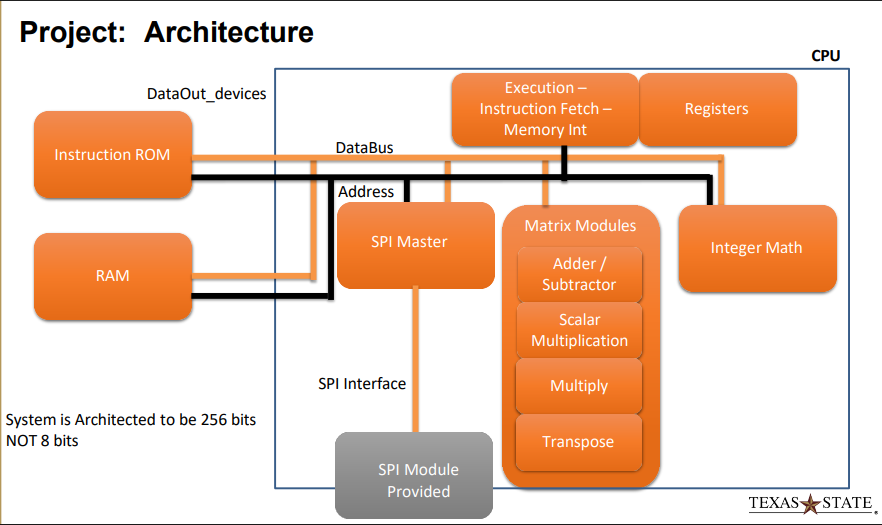

# Simplistic Processing Engine

## Table of Contents

- [Overview](#overview)
- [Project Details](#project-details)
- [How It Operates](#how-it-operates)
- [CPU Operation](#cpu-operation)
- [Input Data](#input-data)
- [Testing](#testing)
- [Deliverables](#deliverables)
- [Repository Layout](#repository-layout)
- [Build & Run](#build--run)
- [License](#license)

***

## Overview

The SPE will be a processor that contains a:

- Matrix ALU
- Integer ALU
- Instruction Fetch
- Execution Engine

### Matrix Unit

The matrix unit will perform matrix multiplication, scalar multiplication, subtraction, addition, and transposition.

### Top Module Unit

The top module is **provided by the professor** and ties all the pieces together.
The provided Top Module **must** comply with the provided interface.

### Testbenching

A testbench will drive a master clock and reset. A **grading module** is added to
make certain that the outputs properly perform all tasks. Following a reset, the CPU will
request the first instruction from the ROM and begin execution of the program.

***

## Project Details

The registers mentioned in this document are internal processor
registers, with a reasonable justification for the number of registers
used.

### Requirements

- The processor **must** be able to execute Branches
- Matrices will be 4x4 with 16 bit elements
- Matrix multiplication will multiply two 4x4 matrices and return an
appropriate size matrix
- Scalar multiplication is multiplying a matrix by a single number
- Add and subtract will add or subtract two 4x4 matrices
- Transpose will flip a matrix along its diagonal

### Constraints

- The system data path width is fixed at 256 bits
- Matrix operands are fixed at 4×4 dimensions with 16-bit elements
- The address bus width is fixed at 16 bits
- Module selection is performed using address bits [15:12]
- The lower 7 address bits are not present on the external address bus
- Main memory, instruction memory, and peripherals are memory-mapped
- Matrix and integer ALUs are accessed via memory-mapped I/O
- Overflow handling for arithmetic operations is optional and not required

### Definitions

- **Word:** A single addressable unit of main memory consisting of 256 bits
- **Reg/Mem:** An instruction operand that may reference either an internal register or a main memory location. The MSB of the field selects the operand type: `0` = memory address, `1` = register
- **Offset (Branch):** A program counter–relative displacement used to modify control flow; size and sign interpretation are implementation-defined
- **STOP Instruction:** An instruction that terminates program execution by halting instruction fetch and execution
- **Execution Engine:** The control unit responsible for instruction sequencing, data movement, and coordination between memory and functional units

## Architecture



The system is architected to be 256 bits

## Memory Organization

- Memory is to be 256 bits wide. Note that the lower 7 bits are
*not* on the address bus

- Instruction memory is only limited to user utilization
- The table below shows the organization of memory mapping

| Memory Location | Module                  |
|-----------------|-------------------------|
| 0000h           | Main Memory             |
| 1000h           | Instruction Memory      |
| 2000h           | Matrix ALU              |
| 3000h           | Integer ALU             |
| 4000h           | Internal Register Block |
| 5000h           | Execution Engine        |

- The address bus will be 16 bits

| Module Address | Module Offset                |
|----------------|------------------------------|
| 15 14 13 12    | 11 10 9 8 7 6 5 4 3 2 1 0    |

### Main Memory Organization

| Memory Location | Information | Memory Location | Information     |
|-----------------|-------------|-----------------|-----------------|
| 0000h           | Matrix 1    | 000Ah           | Integer Data 1  |
| 0001h           | Matrix 2    | 000Bh           | Integer Data 2  |
| 0002h           | Result 1    | 000Ch           | Integer Results |
| 0003h           | Result 2    | 000Dh           | Integer Results |
| 0004h           | Result 3    |                 |                 |
| 0005h           | Result 4    |                 |                 |
| 0006h           | Result 5    |                 |                 |
| 0007h           | Result 6    |                 |                 |
| 0008h           | Result 7    |                 |                 |
| 0009h           | Result 8    |                 |                 |

- Matrix 1 is at address 0
- Matrix 2 is at address 1

## How It Operates

- The test bench will start the system clock and toggle reset
- Execution engine will fetch the first opcode from instruction memory
and begin execution
- The execution engine will direct the transfer of data between the
memory, the appropriate matrix modules, and memory
- The execution engine will continue executing programs until it finds
a `STOP` opcode
- Matrix ALU and integer ALU will *not* require overflow (optional but
not required)

***

## Project Instruction Set

The instruction set will be a subset of the following table:

> **Operand encoding:** The MSB of any `Reg/Mem` field selects the operand type — `0` = memory address, `1` = register

| Instruction   | Opcode    | Destination   | Source 1  | Source 2    |
|---------------|-----------|---------------|-----------|-------------|
| Stop          | FFh       | 00            | 00        | 00          |
| MMult1        | 00h       | Reg/Mem       | Reg/Mem   | Reg/Mem     |
| Madd          | 03h       | Reg/Mem       | Reg/Mem   | Reg/Mem     |
| Msub          | 04h       | Reg/Mem       | Reg/Mem   | Reg/Mem     |
| Mtranspose    | 05h       | Reg/Mem       | Reg/Mem   | Reg/Mem     |
| MScale        | 06h       | Reg/Mem       | Reg/Mem   | Reg/Mem     |
| MScaleImm     | 07h       | Reg/Mem       | Reg/Mem   | Immediate   |
| IntAdd        | 10h       | Reg/Mem       | Reg/Mem   | Reg/Mem     |
| IntSub        | 11h       | Reg/Mem       | Reg/Mem   | Reg/Mem     |
| IntMult       | 12h       | Reg/Mem       | Reg/Mem   | Reg/Mem     |
| IntDiv        | 13h       | Reg/Mem       | Reg/Mem   | Reg/Mem     |
| BNE           | 20h       | Offset        | Reg 1     | Reg 2       |
| BEQ           | 21h       | Offset        | Reg 1     | Reg 2       |
| BLT           | 22h       | Offset        | Reg 1     | Reg 2       |
| BGT           | 23h       | Offset        | Reg 1     | Reg 2       |

***

## CPU Operation

- Matrix Operations:

1. Add the first matrix to the second matrix and store the result in
memory
2. Scale the first matrix by the value in location 0x0A and store in
memory
3. Add the 16-bit numbers at the memory location 0x0a to location 0x0b
and store them in a temporary register
4. Subtract the first matrix from the result in step 2 and store the
result somewhere else in memory
5. If results from step 4 is less than the result from step 2, go to
step 7
6. Transpose the result from step 1 and store it in memory
7. If the memory location 5 != to location 8, go to step 6
8. Scale immediate result in step 2 by the data in the instruction and
store in a temporary register
9. Multiply the result from step 4 by the result in step 5, storing the
result in memory

- Integer operations:
  - Note that those which are in memory locations 0 and 1 are
  assumed to only use the LSW (first 16 bits) of the 256-bit data located at 0
  and 1

1. Multiply the integer value in memory location 0 by memory location 1.
Store it in memory location 0x0A
2. Subtract the integer value in memory location 1 from memory location 0x0A
3. Divide the result from integer step 1 by the result from integer step 2
and store the result in location 0x0B

***

## Input Data

The following input data is used in the grading testbench. The instruction ROM program
must be written to operate on these values

**Matrix 1** (stored at address `0000h`):

| Col 0 | Col 1 | Col 2 | Col 3 |
|-------|-------|-------|-------|
| 15    | 12    | 8     | 13    |
| 8     | 16    | 15    | 9     |
| 11    | 8     | 6     | 7     |
| 12    | 5     | 12    | 8     |

**Matrix 2** (stored at address `0001h`):

| Col 0 | Col 1 | Col 2 | Col 3 |
|-------|-------|-------|-------|
| 10    | 5     | 7     | 9     |
| 11    | 4     | 14    | 2     |
| 7     | 6     | 7     | 8     |
| 12    | 7     | 4     | 9     |

**Scalar / Integer operands:**

| Address | Value |
|---------|-------|
| 000Ah   | `03h` |
| 000Bh   | `0Ch` |

***

## Testing

A top module and testbench is **provided by the professor** to test the design.
The top module defines the interfaces between all modules; the IO must match it exactly.
As part of final grading, the execution engine, Matrix ALU, and Integer ALU
will be copied into a test environment and executed using a testbench that runs the
instructions from the CPU Operation section. **The order of instructions may change**
to verify that results are computed correctly rather than hardcoded.

***

## Deliverables

The following must be submitted for grading:

- **State machine documentation**: diagrams and written explanation of the execution
  unit FSM
- **Output waveforms**: a waveform from each individual operation. Use an appropriate
  radix so that the values are human-readable
- **Simulation transcript**: the full console output from the run that produced your
  waveforms
- **All source code**: every `.sv` file for the project. Code must be well-commented
  and **must compile without errors**

### Grading Rubric

| Criteria                                          | Minimal | Satisfactory | Good | Mastered |
|---------------------------------------------------|---------|--------------|------|----------|
| Can I determine you will finish                   | 5       | 10           | 15   | 20       |
| Did you include waveforms / documentation         | 4       | 6            | 8    | 10       |
| Does it compile                                   | 4       | 6            | 8    | 10       |
| Is code well written (proper SV, well commented)  | 4       | 6            | 8    | 10       |
| Does it perform ALL tasks                         | 20      | 30           | 40   | 50       |
| **Total**                                         | **24**  | **51**       | **78** | **100** |

***

## Repository Layout

```
Processor
├── Makefile
└── processor
    ├── build
    │   ├── out/   # Output files
    │   └── sim/   # Simulation files
    ├── pkgs
    │   └── params.vh # Global parameters
    ├── src
    │   ├── alu
    │   │   ├── int.sv  # Integer ALU
    │   │   └── matrix.sv # Matrix ALU
    │   ├── cpu
    │   │   ├── fetch.sv  # Fetch stage
    │   │   ├── fsm.sv    # Execution FSM
    │   │   ├── opmux.sv  # Operand multiplexer
    │   │   ├── pc.sv     # Program counter
    │   │   └── reg.sv    # Register file
    │   └── mem
    │       └── decode.sv # Memory decoder
    ├── tb
    │   └── tb.sv         # Testbench
    ├── top.sv            # Top module
    └── verilog.mk        # Verilog Makefile
```

## About the Layout

- The project is dicided across 3 main parts:
  - `build` contains the output files
  - `src` contains the main modules of the project
  - `tb` contains the testbench for the project
The System Verilog files are commanded by the `verilog.mk` file. Two
commands can proceed the main build process:
  - `DIR` is the path to the current directory of the Makefile. This is used in
    conjunction with the `latex.mk` file to build the documentation per directory
  - `DATA` is the path to the data file (the simulation output), without an extension,
    that is used in conjunction with the `verilog.mk` file to analyze the System Verilog
    files via GTKwave

***

## Build & Run

### Build Requirements

### Makefile

- `make` for Makefile automation.

### LaTeX

- `texlive` for LaTeX compilation.
- `pdflatex` for LaTeX compilation (Generating the PDF).
- `bibtex` for BibTeX integration (Listing any references).

### System Verilog

- `iverilog` for System Verilog compilation.

### Simulation Viewing

- `GTKwave` for simulation viewing.

### About the Makefiles

- There is a Master Makefile that is used to build and compile the two sections of the
project—either the processor or the documentation—using the appropriate sub-makefiles.
- For building documentation files, the `DIR` variable must be set to the
path to the desired directory.
- For building System Verilog files, there is no sub-command needed until the simulation
phase is reached.
- For running the simulation, the `DATA` variable must be set to the path to the
data file for the simulation.

### Master Makefile Commands

- The following commands are available for the master Makefile and are done from the root directory of the project where the Makefile resides

| Command              | Description                                                    |
|----------------------|----------------------------------------------------------------|
| `make help`          | Display available targets for both tex and sv files.           |
| `make latex`         | Build the documentation files. Note that `DIR` must be set.    |
| `make latex.open`    | Open the documentation files. Note that `DIR` must be set.     |
| `make latex.clean`   | Clean the documentation files. Note that `DIR` must be set.    |
| `make verilog`       | Build the System Verilog files.                                |
| `make verilog.clean` | Clean the System Verilog files.                                |
| `make verilog.sim`   | Run the System Verilog files. Note that `DATA` must be set.    |

- If anything is unclear, use the `help` command for the master Makefile and refer to the
table above

***

## License

Free access to this code is granted under the MIT license to any person
with a copy of this software and associated documentation files.
